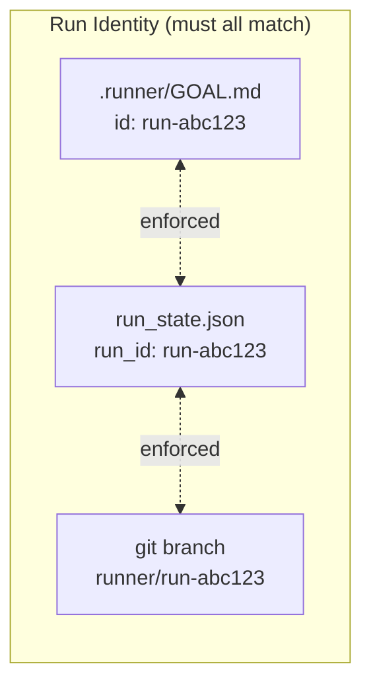
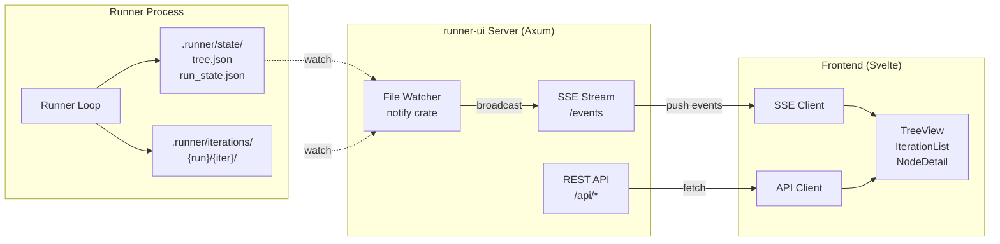
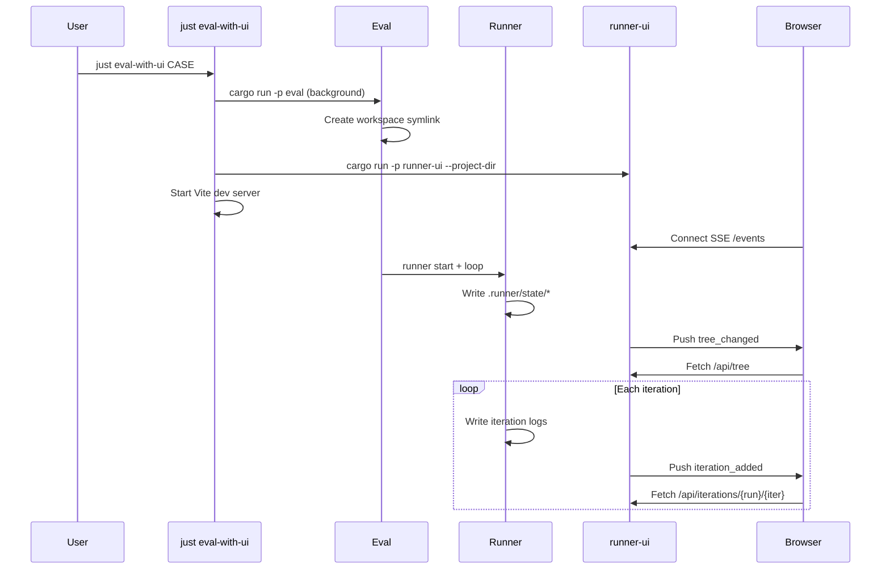

# Architecture: Deterministic Goal-Driven Agent Loop Runner (MVP)

This document is the canonical technical reference for the **deterministic local runner**.

- Vision principles: `VISION.md`
- Decision log (dated rationale): `DECISIONS.md`
- CLI behavior reference: `docs/project/cli.md`
- Project-level goal/spec provided to each iteration: `.runner/GOAL.md` (YAML frontmatter includes `id`, set by `runner start`)

Note on paths: in this document, `.runner/...` and `schemas/...` refer to paths in the **target project
repo root**. `runner init` creates the `.runner/` directory and placeholder files in the target project.

## 1) Goals & Non-Negotiable Invariants

The runner exists to make progress **deterministically** while agents remain flexible.

Non-negotiables (source: `VISION.md` + decisions captured in `DECISIONS.md`):

- **Determinism over convenience**
  - Given the same repo state and inputs, the runner makes the same choices.
  - Any tie-breaks are explicit and stable.
- **Strict schemas**
  - The task tree is machine-facing and strictly validated.
  - No schema drift during a run.
- **Tree is the source of truth**
  - Progress state lives only in the tree.
  - Markdown “memory” docs are supporting context only.
- **Fresh context per iteration**
  - Every iteration is a new agent session.
  - Continuity is provided by committed repo artifacts + iteration logs.
- **Sequential only**
  - One actionable leaf at a time. No parallel workflows.
- **No pass without green guards**
  - `passes=true` can only be recorded by the runner after the guard entrypoint succeeds.
- **Immutability**
  - Any node with `passes=true` is immutable: record and structural placement.
  - Improvements/refactors happen via **new nodes**, not edits to passed nodes.

## 2) System Boundary (Runner vs Agent)

The runner is the deterministic orchestrator; the agent is a tool invoked by the runner.

Runner responsibilities:

- Enforce git safety (branch + cleanliness).
- Load/validate/update/persist the task tree deterministically.
- Decide which leaf to work on next (deterministic selection).
- Prepare `context/` directory with goal, history, and failure info for the agent.
- Build and pass a stable prompt pack to the executor.
- Run guards (`just ci`) only when agent declares `status: done`.
- Apply runner-owned state transitions (`passes`, `attempts`, derived internal passes).
- Write iteration logs and commit each iteration with a deterministic message.
- Determine `stuck` state when `attempts == max_attempts`; hard-stop the loop.

Agent responsibilities:

- Edit code and/or open nodes to satisfy goals.
- Output structured JSON with `status` (`done`/`retry`/`decomposed`) and `summary`.
- If `decomposed`: must add children to the selected node in the tree.
- If `done` or `retry`: must not add children to the selected node.
- Record uncertainty in `.runner/state/assumptions.md` and `.runner/state/questions.md`.
- Keep `.runner/state/tree.json` strictly valid when editing it.
- Never mutate passed nodes; never set `passes=true` (runner-owned).
- Always output a summary (explicit, not relying on autocompact).

## 3) Canonical Artifacts (File/Dir Contracts)

### 3.1 Runner-owned state (`state/`)

- `.runner/state/tree.json`: canonical task tree (strict JSON, canonicalized formatting on write).
- `.runner/state/schema.json`: versioned schema for tree validation.
- `.runner/state/config.toml`: runner configuration (max_attempts defaults, guards, timeouts, output caps).
- `.runner/state/run_state.json`: run/iteration bookkeeping (run-id, iter counter, last outcome).
- `.runner/state/agent_output.schema.json`: JSON Schema for agent output.
- `.runner/state/assumptions.md`: accumulated assumptions (agent may append).
- `.runner/state/questions.md`: open questions for human review (agent may append).

`run_state.json` format (minimal):

```json
{
  "run_id": "string|null",
  "next_iter": 1,
  "last_status": "done|retry|decomposed|null",
  "last_summary": "string|null",
  "last_guard": "pass|fail|skipped|null"
}
```

Agent may read `state/` but runner-owned fields (`passes`, `attempts`) are overwritten by runner.
Agent may append to `assumptions.md` and `questions.md`; runner does not clear them per-iteration.

### 3.2 Ephemeral context (`context/`)

Runner clears and rewrites `context/` at each iteration start. Agent reads this for iteration context.

- `.runner/context/goal.md`: current node's goal + acceptance criteria.
- `.runner/context/history.md`: summary from previous attempt (if retry).
- `.runner/context/failure.md`: guard failure output from previous attempt (if guards failed).

Assumptions and questions persist in `state/` and are not part of the ephemeral context.

### 3.3 Iteration logs (`iterations/`) — local-only, gitignored

Append-only immutable log of all iterations:

- `.runner/iterations/{run-id}/{iter-n}/output.json`: agent's status + summary.
- `.runner/iterations/{run-id}/{iter-n}/guard.log`: full guard output (if guards ran).
- `.runner/iterations/{run-id}/{iter-n}/executor.log`: executor stdout/stderr (if executor ran).
- `.runner/iterations/{run-id}/{iter-n}/meta.json`: timing, node id, mode, outcome.
- `.runner/iterations/{run-id}/{iter-n}/tree.before.json`: tree snapshot before iteration.
- `.runner/iterations/{run-id}/{iter-n}/tree.after.json`: tree snapshot after iteration.

The runner must ensure `.runner/iterations/` is gitignored so future iterations can still start from a
clean working tree.

For file formats and write order: [`docs/project/iteration-logs.md`](docs/project/iteration-logs.md)

### 3.4 Extensibility sidecars (no schema drift)

Future features attach to nodes via deterministic sidecars keyed by node id (not by adding schema fields):

- `.runner/nodes/{node-id}/context.md`
- `.runner/nodes/{node-id}/tools.json`
- `.runner/nodes/{node-id}/artifacts/...`

## 4) Task Tree Data Model (v1)

Canonical format: **JSON-only**.

### 4.1 Node fields (conceptual)

Every node:

- `id: string` (globally unique)
- `order: integer` (per-sibling ordering key)
- `title: string`
- `goal: string` (declarative)
- `acceptance: string[]` (human-readable bullets)
- `passes: boolean` (**runner-owned**)
- `attempts: integer` (**runner-owned**)
- `max_attempts: integer`
- `children: Node[]`

### 4.2 Ordering and deterministic selection

Sibling order is defined as sorting by `(order ASC, id ASC)` and then traversing depth-first to pick the
**leftmost open leaf**.

The runner canonicalizes the on-disk tree by sorting `children` arrays accordingly when writing.

### 4.3 Passing semantics

- Leaf nodes pass only when:
  - agent declares `status: done`, and
  - guards succeed (`just ci` exit code 0), and
  - tree invariants pass.
- Non-leaf nodes pass when **all children pass** (derived by the runner).
- Guards are skipped when agent declares `status: retry` (save CI cycles on known-incomplete work).

### 4.4 Agent status invariants

The runner validates consistency between agent status and tree changes:

| Status | Tree constraint |
|--------|-----------------|
| `done` | Selected node must NOT have gained children |
| `retry` | Selected node must NOT have gained children |
| `decomposed` | Selected node MUST have gained children |

Violation is treated as malformed iteration → retry with error context.

### 4.5 Immutability enforcement

If a node has `passes=true` in the previous committed tree, then in the next tree it must:

- exist with the same `id`
- be byte-for-byte identical in canonical form (all fields)
- appear in the same structural position (same parent + sibling ordering keys)

For validation implementation details: [`docs/project/tree-validation.md`](docs/project/tree-validation.md)

## 5) Core Loop as a Deterministic State Machine

Each `step` is one deterministic iteration:

1. Ensure repo safety:
   - refuse `runner step` on `main`/`master` (use `runner start` to branch off immediately)
   - ensure clean working tree (including untracked)
2. Load + validate `.runner/state/tree.json` against schema + invariants.
3. Deterministically select next open leaf.
4. Prepare `context/` directory:
   - clear previous contents
   - write `goal.md` with selected node's goal + acceptance
   - write `history.md` with previous attempt summary (if retry)
   - write `failure.md` with guard output (if previous guards failed)
5. Build a stable prompt pack.
6. Invoke the executor (fresh agent session) with a 30-minute wall clock budget.
7. Read agent output from `iterations/{id}/output.json` (status + summary).
8. Re-load + validate `.runner/state/tree.json` (including passed-node immutability).
9. Validate agent status invariants:
   - `decomposed` → node gained children
   - `done`/`retry` → node did NOT gain children
10. Process based on agent status:
    - **done**: run guards (`just ci`), capture output
    - **retry**: skip guards, increment attempts
    - **decomposed**: validate tree, progress to next node
11. Apply deterministic state updates (see [`docs/project/state-updates.md`](docs/project/state-updates.md)):
    - `passes=true` only when `done` + guards pass (runner-owned)
    - increment attempts on `done` + guards fail, or on `retry` (runner-owned)
    - runner-internal failures do not increment attempts
    - derive internal node passes
12. Persist:
    - write tree atomically (canonical form)
    - write iteration logs (output.json, guard.log, meta.json, tree snapshots)
    - commit the iteration
13. Stop when `root.passes == true` (no open leaves remain) or `attempts == max_attempts` (stuck → hard-stop with non-zero exit).

### 5.1 Deterministic recovery: invalid tree

If the tree is invalid after an agent session, the runner enters a special **REPAIR TREE** step that:

- does not select a normal leaf
- prompts the agent to restore schema validity
- commits the repair attempt (keeping the loop automation-first)

### 5.2 Step orchestration flow (visual)

```mermaid
flowchart TD
    subgraph init["1. Initialize"]
        A["Load run_state.json
        ─────────────────
        Get run_id, next_iter,
        last_status for context"]

        B["Load & validate tree.json
        ─────────────────
        Parse tree, check schema,
        snapshot as prev_tree"]
    end

    subgraph select["2. Select Target"]
        C["leftmost_open_leaf()
        ─────────────────
        DFS for first node where
        passes=false, no children"]

        C -->|"None"| DONE["Return: tree complete"]
        C -->|"Found"| D

        D["Build node path
        ─────────────────
        e.g. root/backend/auth
        for prompt context"]
    end

    subgraph context["3. Prepare Context"]
        E["write_context()
        ─────────────────
        Clear .runner/context/
        Write goal.md, history.md,
        failure.md (if last fail)"]

        F["PromptBuilder.build()
        ─────────────────
        Assemble sections within
        budget (default 40KB)"]
    end

    subgraph exec["4. Execute Agent"]
        G["execute_and_load()
        ─────────────────
        Spawn codex exec with
        prompt on stdin, wait
        for output.json"]

        H["Load next_tree
        ─────────────────
        Agent may have modified
        tree.json (decomposition)"]
    end

    subgraph validate["5. Validate Output"]
        I["check_passed_node_immutability()
        ─────────────────
        Ensure agent didn't touch
        any node with passes=true"]

        J["validate_status_invariants()
        ─────────────────
        done/retry → no new children
        decomposed → must add children"]
    end

    subgraph guards["6. Conditional Guards"]
        K{status?}
        K -->|"retry"| SKIP["GuardOutcome::Skipped
        ─────────────────
        No point running tests
        on incomplete work"]

        K -->|"done"| L["run just ci
        ─────────────────
        Execute guards with
        30min timeout, capture
        stdout/stderr"]

        L --> M{exit code?}
        M -->|"0"| PASS["GuardOutcome::Pass"]
        M -->|"non-zero"| FAIL["GuardOutcome::Fail"]
    end

    subgraph update["7. Persist Results"]
        N["apply_state_updates()
        ─────────────────
        retry → attempts += 1
        done+pass → passes = true
        done+fail → attempts += 1"]

        O["write_tree()
        ─────────────────
        Save updated tree with
        new attempts/passes values"]

        P["write_iteration()
        ─────────────────
        Save meta.json, output.json,
        guard.log, tree snapshots
        to iterations/{run}/{iter}/"]

        Q["write_run_state()
        ─────────────────
        Increment next_iter,
        store last_status/summary/guard
        for next iteration context"]
    end

    R["Return StepOutcome
    ─────────────────
    run_id, iter, selected_id,
    status, guard outcome"]

    A --> B --> C
    D --> E --> F --> G --> H
    H --> I --> J --> K
    SKIP --> N
    PASS --> N
    FAIL --> N
    N --> O --> P --> Q --> R

    style DONE fill:#2d5a27,color:#fff
    style PASS fill:#2d5a27,color:#fff
    style FAIL fill:#8b0000,color:#fff
    style SKIP fill:#555,color:#fff
```



#### Guard execution logic

For details on when guards run, timeout/output handling, and outcome semantics, see
[`docs/project/guard-execution.md`](docs/project/guard-execution.md).

## 6) Component Architecture (MVP)

Keep deterministic decision-making separate from I/O. This makes behavior testable and reduces
non-deterministic failure modes.

### 6.1 "Core" (pure-ish logic; deterministic)

- **Selector**
  - Computes the next open leaf id/path (leftmost open leaf).
- **Classifier**
  - Determines DECOMPOSE vs EXECUTE from a list of changed paths (for commit message classification).
- **InvariantChecker**
  - Schema validation (strict) + invariants (immutability, id uniqueness, ordering, etc.).
- **StatusValidator**
  - Validates agent status invariants (decomposed → children added, done/retry → no children).
- **StateUpdater**
  - Applies runner-owned updates (`passes`, `attempts`, derived internal passes).
- **AgentOutputParser**
  - Parses agent output JSON, validates status + summary fields.

### 6.2 "Adapters" (I/O boundary; observable side effects)

- **TreeStore**
  - Loads tree JSON from `state/tree.json`.
  - Canonicalizes and atomically writes tree JSON.
- **ContextWriter**
  - Clears and writes `context/` directory each iteration.
  - Writes goal.md, history.md, failure.md based on iteration state.
- **PromptBuilder**
  - Produces a stable prompt pack (stable ordering and bounded size).
- **Executor**
  - Stable interface; backends: Codex CLI, Claude CLI.
  - Must enforce structured JSON output (status + summary).
  - Must disable autocompact; agent outputs explicit summary.
- **GuardRunner**
  - Runs `just ci` with timeouts/output caps.
  - Only invoked when agent status is `done`.
- **GitManager**
  - Branch policy, clean checks, diffs for classification, deterministic commits.
- **IterationLogger**
  - Writes local-only `.runner/iterations/...` logs and metadata.
  - Persists output.json, guard.log, meta.json, tree snapshots.

## 7) Determinism Rules (Implementation Guardrails)

Determinism is enforced by design constraints plus implementation guardrails:

- Stable sorting everywhere:
  - nodes: `(order ASC, id ASC)`
  - file lists: lexicographic
- Canonical JSON:
  - stable key order (struct field order, not hash map iteration)
  - canonical whitespace/indentation
  - children arrays sorted on write
- No implicit “now” in decisions:
  - timestamps are allowed in logs, but must not affect selection or updates
  - run-id should be an explicit input (or generated once at run start and treated as an input)
- Output caps + timeouts:
  - limit stdout/stderr capture sizes
  - enforce the shared 30-minute iteration budget deterministically

## 8) Executor & Prompt Pack

For detailed documentation on context preparation and prompt assembly, see
[`docs/project/context-preparation.md`](docs/project/context-preparation.md).

Executor requirements:

- "Fresh agent session" per iteration.
- Replaceable backends behind a stable interface.
- Timeouts/output caps applied by the runner.
- Must enforce structured JSON output with `status` and `summary` fields.
- Must disable autocompact; agent outputs explicit summary.

Agent output format (written to `iterations/{id}/output.json`):

```json
{
  "status": "done" | "retry" | "decomposed",
  "summary": "Human-readable summary of what was done/attempted..."
}
```

Prompt pack (stable order, minimal but sufficient):

1. Runner contract / invariants (especially: immutability, runner-owned fields, status requirements).
2. `.runner/context/goal.md` (current node).
3. `.runner/context/history.md` (previous attempt summary, if retry).
4. `.runner/context/failure.md` (guard failure output, if previous guards failed).
5. Selected leaf path + selected leaf subtree (full).
6. Deterministic summary of the rest of the tree (bounded).
7. `.runner/state/assumptions.md`, `.runner/state/questions.md`.
8. Output contract: "You MUST write output.json with status and summary before session ends."

## 9) Git Policy (MVP)

Locked MVP policy (per `DECISIONS.md`):

- Refuse to run on `main`/`master`.
- Require clean working tree at iteration start (`git status --porcelain` empty, including untracked).
- Commit every iteration (including failures).
- Commit messages are deterministic and use Conventional Commits:
  - `chore(loop): run <run-id> iter <iter-n> node <node-id> status=<done|retry|decomposed> guard=<pass|fail|skipped>`

## 10) Run ID / Goal ID Lifecycle

Each run is uniquely identified by a run ID that must match across three locations:



### `runner start`

1. Reads existing `id` from GOAL.md frontmatter (or generates `run-<sha8>[-suffix]`)
2. Creates/checkouts `runner/<id>` branch
3. Writes `id` to GOAL.md frontmatter
4. Resets `run_state.json` if run_id changed
5. Commits bootstrap

### `runner step` enforcement

Before any iteration, validates:

- Not on `main`/`master`
- `run_state.run_id` == GOAL.md `id`
- Current branch == `runner/<run_id>`

All failures point to `(run 'runner start')`.

### Starting a new run

To start fresh after editing the goal: change or remove the `id` in GOAL.md, then `runner start`.
The old branch remains for rollback.

For detailed flow diagrams: [`docs/project/run-id-lifecycle.md`](docs/project/run-id-lifecycle.md)

## 11) Observability (Iteration Logs)

Local-only logs live under:

`.runner/iterations/<run-id>/<iter-n>/`

Minimum recommended contents:

- `meta.json`
- `executor.log`
- `guard.log` (`status=done` only)
- `tree.before.json` / `tree.after.json` (canonical snapshots)

Optional:

- `diff.patch`

For file formats and structure: [`docs/project/iteration-logs.md`](docs/project/iteration-logs.md)

## 12) Open Decisions (Need Human Input)

These are not settled yet and materially affect implementation details:

- Defaults (MVP):
  - global `max_iterations` for the run (configured in `.runner/state/config.toml`)
  - default `max_attempts` for new leaves (configured in `.runner/state/config.toml`)
  - output caps for executor/guards (configured in `.runner/state/config.toml`)
- Executor structured output:
  - Codex schema output is implemented
  - Claude Code equivalent is deferred (Codex-only for now)
- ~~Stuck policy~~ → **decided**: hard-stop (see `DECISIONS.md`)
- Whether to emit machine-readable events (ex: `events.jsonl`) in MVP or defer.

## 13) Evaluation Framework (`eval/`)

The `eval` crate provides a harness for running runner loops against declarative test cases.
For detailed documentation, see [`docs/project/eval.md`](docs/project/eval.md).

### 13.1 Purpose

- Local experimentation with real runner loops (not mocked)
- Declarative case definitions (TOML format)
- Outcome classification: success, fail, stuck, error
- Result capture for analysis and debugging

### 13.2 Case format

Cases live in `eval/cases/*.toml`:

```toml
[case]
id = "calculator-go"
goal = "Create a calculator CLI in Go..."

[config]
max_iterations = 30
max_attempts_default = 3

[[checks]]
type = "file_exists"
path = "main.go"

[[checks]]
type = "command_succeeds"
cmd = ["go", "build", "."]

[[checks]]
type = "runner_completed"
```

### 13.3 Execution flow

1. Build runner binary (`cargo build -p runner`)
2. Create isolated workspace (fresh git repo, optional case-provided `justfile`)
3. `runner start` → configure → `runner loop`
4. Capture artifacts (tree, iteration logs, guard output)
5. Run checks against final workspace state
6. Classify outcome based on runner exit code + check results

### 13.4 Outcome classification

| Runner exit | Checks pass | Outcome |
|-------------|-------------|---------|
| 0           | Yes         | Success |
| 0           | No          | Fail    |
| 3           | (any)       | Stuck   |
| 1, 2, None  | (any)       | Error   |

### 13.5 Artifacts

Results are captured under `eval/results/<case-id>/<eval-run-id>/`:

- `meta.json` — run metadata, timing, outcome
- `checks.json` — check results with pass/fail + diagnostics
- `tree.json`, `run_state.json` — runner state snapshots
- `iterations/` — full iteration logs from the run
- `runner.start.log`, `runner.loop.log` — command output

## 14) Runner UI (`runner-ui/`)

### 14.1 Purpose

Read-only web interface for monitoring runner execution:

- Real-time updates via SSE (Server-Sent Events)
- File-system based communication (no IPC)
- Non-intrusive (runner is unaware of UI)

### 14.2 Architecture



### 14.3 Components

- `main.rs` — Server init, CLI args, routing
- `state.rs` — AppState, ChangeEvent types
- `sse.rs` — File watcher, SSE stream, debouncing (100ms)
- `routes.rs` — REST endpoints

### 14.4 API Endpoints

| Endpoint | Returns |
|----------|---------|
| `/api/tree` | Full task tree JSON |
| `/api/run-state` | Run bookkeeping |
| `/api/iterations` | List of runs/iterations |
| `/api/iterations/{run}/{iter}` | Iteration detail (meta+output) |
| `/api/iterations/{run}/{iter}/guard.log` | Guard output text |
| `/events` | SSE stream |

### 14.5 SSE Events

- `tree_changed` — tree.json modified
- `run_state_changed` — run_state.json modified
- `iteration_added` — new iteration directory created

### 14.6 Design Principles

- **Read-only by design** — never writes to `.runner/`
- **Non-intrusive** — runner unaware of UI
- **Event-driven** — SSE push vs polling
- **Graceful degradation** — API-only without static files

## 15) Eval + UI Integration

### 15.1 Overview



### 15.2 Workspace Symlink Pattern

Eval creates a predictable symlink for monitoring:

```text
eval/workspaces/{case}_latest/  →  actual workspace directory
```

runner-ui mounts this path, allowing stable URLs regardless of the underlying workspace location.

### 15.3 Usage

```bash
just eval-with-ui CASE     # Combined: eval + backend + frontend
just ui-server DIR         # Backend only
just ui-dev                # Frontend dev server only
```
