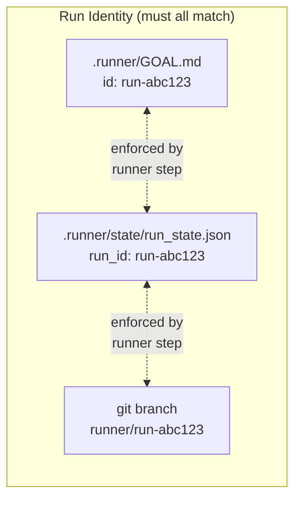
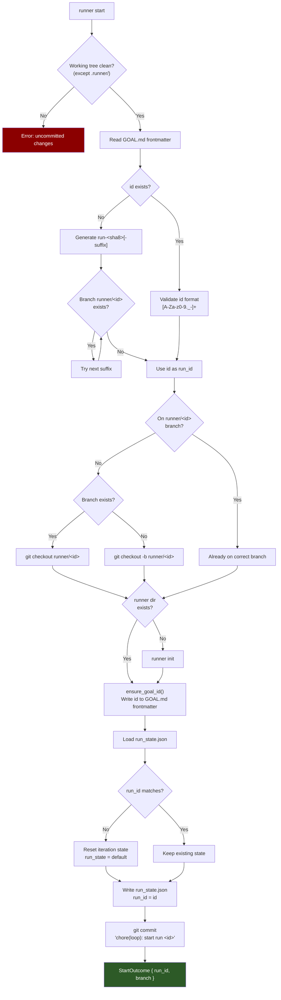
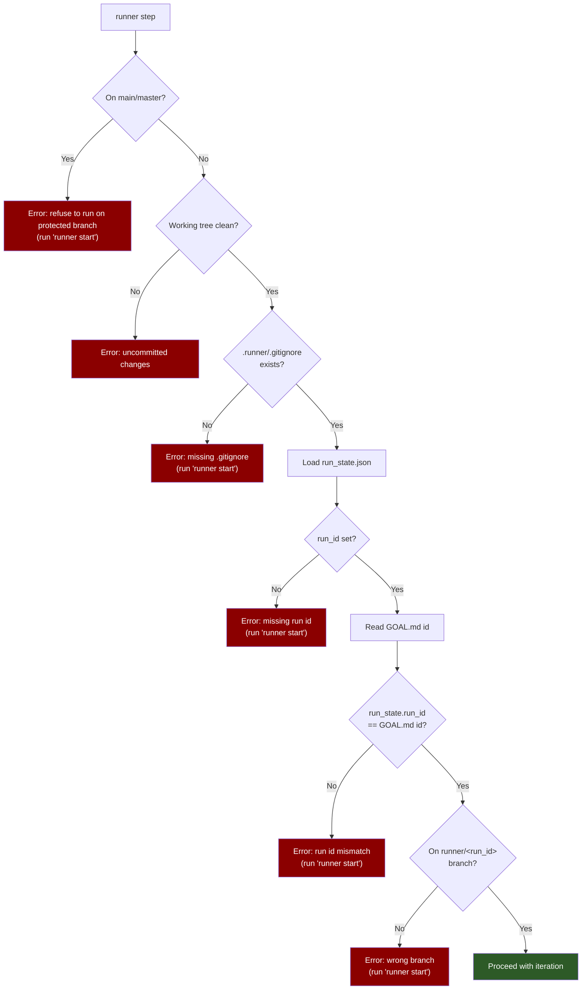
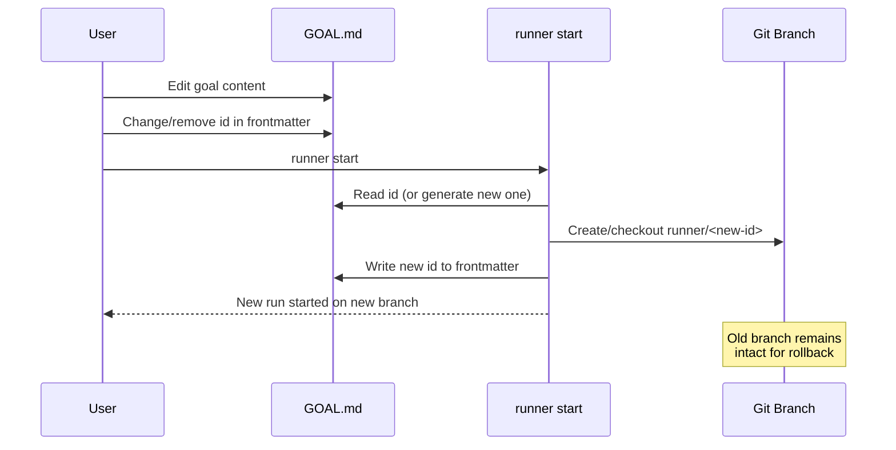

# Run ID / Goal ID Lifecycle

The runner implements **deterministic, branch-isolated runs** where each run is identified by a unique ID stored in multiple locations that must match.

## Identity Invariant



This design ensures:

- **Isolation** — Each run gets its own git branch for clean rollback
- **Resumability** — Re-running `runner start` on same goal ID resumes work
- **Intentionality** — Changing the goal requires explicit ID update

## `runner start` Flow

`runner start` initializes or resumes a run by ensuring all three identity sources are consistent.



### ID Generation

When no ID exists in GOAL.md, `runner start` generates one:

```text
run-<HEAD-sha-8-chars>[-suffix]
```

Example: `run-abc12345`, or `run-abc12345-2` if the first branch already exists.

## `runner step` Enforcement

Before executing any iteration, `runner step` validates all three identity sources match.



All error messages point to `(run 'runner start')` as the fix.

## Goal ID Storage

The ID lives in YAML frontmatter of `.runner/GOAL.md`:

```markdown
---
id: run-abc12345
---

# Goal

Implement the feature...
```

### Frontmatter Operations

| Operation | Behavior |
|-----------|----------|
| `read_goal_id()` | Parse frontmatter, return `Some(id)` or `None` |
| `ensure_goal_id()` | Upsert `id:` line, preserve other keys |
| `validate_id()` | Ensure `[A-Za-z0-9._-]+` (branch-safe) |

## Starting a New Run After Goal Edit

To start fresh after modifying the goal:



Steps:

1. Edit `.runner/GOAL.md` — change the `id:` value or remove it entirely
2. Run `runner start`
   - If ID removed: auto-generates new ID from HEAD sha
   - Creates new `runner/<new-id>` branch
   - Resets iteration state

The old branch remains intact for reference or rollback.

## Key Implementation Locations

| Component | File | Line | Purpose |
|-----------|------|------|---------|
| `start_run()` | `runner/src/start.rs` | 25 | Orchestrates run initialization |
| `generate_run_id()` | `runner/src/start.rs` | 99 | Creates unique run-<sha>[-suffix] |
| `enforce_git_policy_pre_step()` | `runner/src/step.rs` | 233 | Refuses main/master, requires clean tree |
| `enforce_run_id_matches_goal()` | `runner/src/step.rs` | 264 | Validates run_state vs GOAL.md |
| `enforce_on_run_branch()` | `runner/src/step.rs` | 280 | Validates current branch name |
| `read_goal_id()` | `runner/src/io/goal.rs` | 12 | Parses frontmatter id |
| `ensure_goal_id()` | `runner/src/io/goal.rs` | 20 | Writes id to frontmatter |
| `validate_id()` | `runner/src/io/goal.rs` | 28 | Validates id format |
